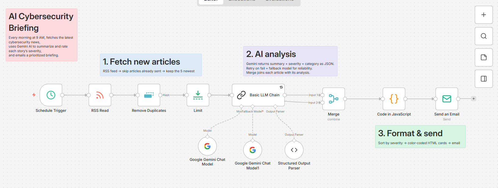
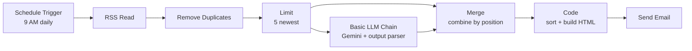

# 🛡️ AI Cybersecurity Briefing

An n8n workflow that reads the latest cybersecurity news every morning, uses Google Gemini to summarize each story and rate its severity, and emails a prioritized, color-coded briefing with the most critical threats first.

## What it does

Every day at 9 AM, the workflow:

1. Fetches the latest articles from [The Hacker News](https://thehackernews.com/) RSS feed
2. Skips any article it has already sent
3. Sends each new article to Gemini, which returns a structured analysis:
   - **summary**: one sentence on why the story matters and who is affected
   - **severity**: Critical, High, Medium or Low
   - **category**: Vulnerability, Malware, Data Breach, Phishing, AI Security, Policy or Other
4. Sorts stories by severity and builds an HTML email with color-coded cards
5. Emails the briefing, with a subject line that flags critical stories

## Architecture

## Nodes

| Node | Purpose |
|---|---|
| Schedule Trigger | Runs the workflow every day at 9 AM (Asia/Kolkata) |
| RSS Read | Fetches the latest articles from the feed |
| Remove Duplicates | Drops articles processed in previous executions, deduplicated on the article link |
| Limit | Keeps the 5 newest unseen articles |
| Basic LLM Chain | Sends each article's title and details to Gemini with severity rules in the prompt |
| Google Gemini Chat Model | Primary AI model |
| Google Gemini Chat Model (fallback) | Backup model used automatically if the primary fails |
| Structured Output Parser | Forces the AI to return valid JSON (`summary`, `severity`, `category`) |
| Merge | Joins each article with its AI analysis (combine by position) |
| Code (JavaScript) | Sorts by severity, counts stories per level, and builds the HTML email |
| Send Email (SMTP) | Delivers the briefing |

## Reliability

- **Retry On Fail**: the AI step retries automatically with a delay between attempts
- **Fallback model**: a second Gemini model takes over when the primary is unavailable
- **Error workflow**: a separate workflow (`error-alert.json`) emails the failed node name, the error message and a link to the execution whenever the briefing fails
- **No empty emails**: if there are no new articles, the workflow stops quietly

## Setup

### Prerequisites

- n8n (self-hosted or n8n Cloud)
- A Gmail account with 2-Step Verification enabled and an [App Password](https://myaccount.google.com/apppasswords)
- A free Gemini API key from [Google AI Studio](https://aistudio.google.com/)

### Steps

1. **Import the workflows**: in n8n, create a new workflow, open the **⋯** menu, choose **Import from File**, and select `workflow.json`. Repeat for `error-alert.json`.
2. **Add credentials**:
   - SMTP: host `smtp.gmail.com`, port `465`, SSL/TLS on, your Gmail address and App Password
   - Google Gemini: your API key
3. **Set your email address** in both Send Email nodes (replace `you@example.com`).
4. **Pick models**: in each Gemini Chat Model node, choose a current model from the dropdown. Model names change often, so don't rely on the name stored in the file.
5. **Publish the Error Alert workflow**, then open the briefing workflow's **Settings** and set **Error Workflow** to `Error Alert`.
6. **Set your timezone** in the workflow settings.
7. **Test**: deactivate Remove Duplicates while testing (select it and press `D`), click **Execute workflow**, then turn it back on.
8. **Publish** the workflow to run it on schedule.

> Credentials are never included in exported n8n workflows. Never commit API keys or passwords to this repository.

## Customize it

- **Different news source**: swap the RSS URL for any other feed
- **More stories**: raise the Limit node (each story is one AI call)
- **Different delivery**: replace Send Email with a Telegram, Slack or Discord node
- **Different AI**: swap the Gemini Chat Model for OpenAI, Claude, Groq or a local Ollama model without changing anything else

## Challenges and lessons

- **HTML vs RSS**: fetching the site's homepage returned HTML meant for humans. The RSS feed provides clean, structured data and doesn't break when the site is redesigned.
- **Retired model (404)**: the Gemini model I first used was no longer available to new users. Lesson: pick models from the dropdown rather than hardcoding names from tutorials.
- **Overloaded model (503)**: the replacement model was under high demand. Retries and a fallback model made the workflow resilient.
- **Keeping data together**: the AI chain returns only its analysis, so the flow splits into two paths and a Merge node rejoins each article with its analysis. Append mode stacked them into 10 separate items; combine by position was the fix.
- **Auto-added chat trigger**: adding an AI node with no input made n8n insert a Chat Trigger and set the prompt source to the chat input. Removing it meant switching the prompt source to "Define below".

## Future improvements

- Pull from multiple security feeds and deduplicate across them
- Deliver critical alerts instantly via Telegram, not just in the daily email
- Host on an always-on server instead of a local machine
- Store past briefings in a database for weekly trend reports

## Tech stack

n8n · Google Gemini · JavaScript · RSS · SMTP

---

Built by **Manya Monga** as part of my n8n and AI automation learning journey. [Connect on LinkedIn](https://www.linkedin.com/in/manya-monga-39ab1a374?utm_source=share_via&utm_content=profile&utm_medium=member_ios)
