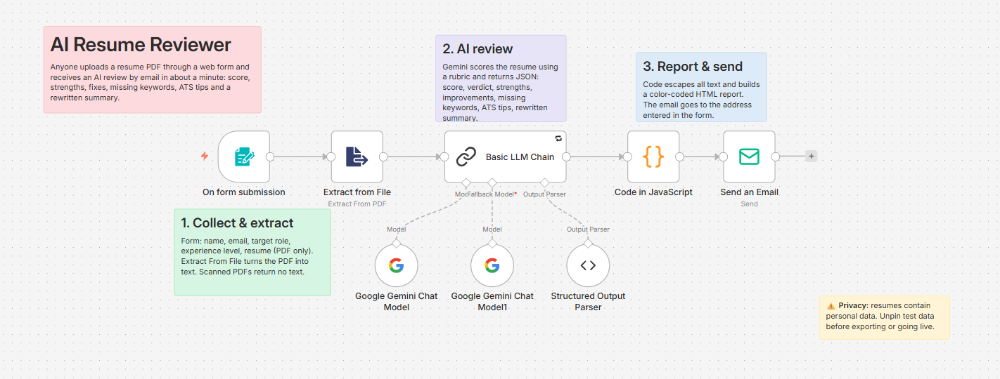
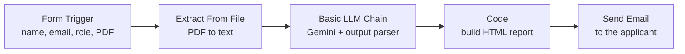

# 📄 AI Resume Reviewer

An n8n workflow that turns a simple web form into an AI resume coach. Anyone can upload their resume as a PDF, choose a target role, and receive a detailed review by email within about a minute: a score out of 100, strengths, specific fixes, missing keywords, ATS tips and a rewritten professional summary.



## What it does

1. A user fills in a form hosted by n8n: name, email, target role, experience level and a resume PDF
2. The workflow extracts the text from the PDF
3. Google Gemini reviews the resume against what hiring managers expect for that role and experience level, and returns structured JSON
4. JavaScript turns the review into a formatted HTML report with a color-coded score
5. The report is emailed to the person who submitted the form

| The form | The emailed report |
|---|---|
|  |  |

## Architecture



## Nodes

| Node | Purpose |
|---|---|
| On form submission | Hosts the web form and starts the workflow when someone submits it |
| Extract From File | Converts the uploaded PDF (binary data) into plain text |
| Basic LLM Chain | Sends the resume text, target role and experience level to Gemini with a scoring rubric |
| Google Gemini Chat Model | Primary AI model |
| Google Gemini Chat Model (fallback) | Backup model used automatically if the primary fails |
| Structured Output Parser | Forces the AI to return valid JSON matching the report structure |
| Code (JavaScript) | Reads the form answers and the AI review, escapes all text, and builds the HTML report |
| Send Email (SMTP) | Sends the report to the email address entered in the form |

### Form fields

| Field | Type |
|---|---|
| Full Name | Text |
| Email | Email |
| Target Role | Text |
| Experience Level | Dropdown: Student / Fresher, 1–3 years, 3–5 years, 5+ years |
| Resume | File (PDF only) |

### AI output

```json
{
  "overall_score": 72,
  "verdict": "Solid technical foundation, but achievements lack measurable impact.",
  "strengths": ["..."],
  "improvements": [{ "issue": "...", "fix": "..." }],
  "missing_keywords": ["..."],
  "ats_tips": ["..."],
  "rewritten_summary": "..."
}
```

The prompt includes a scoring rubric (90+ interview-ready, 75–89 strong, 60–74 needs work, below 60 major gaps), requires feedback to refer to the actual resume content, and tells the model to write the new summary using only facts from the resume so it never invents experience.

## Reliability and security

- **Retry On Fail** and a **fallback model** keep the review working when the AI provider is overloaded
- **Error workflow**: linked to the [Error Alert](../01-ai-cybersecurity-briefing/error-alert.json) workflow, which emails the failed node and error message
- **HTML escaping**: the target role comes from the user and the review comes from the AI, so all text is escaped before it goes into the email to prevent broken layouts or injected HTML
- **No personal data in this repo**: pinned test data was removed before export, and credentials are never included in exported n8n workflows

## Setup

### Prerequisites

- n8n (self-hosted or n8n Cloud)
- A Gmail account with 2-Step Verification enabled and an [App Password](https://myaccount.google.com/apppasswords)
- A free Gemini API key from [Google AI Studio](https://aistudio.google.com/)

### Steps

1. **Import**: in n8n, create a new workflow, open the **⋯** menu, choose **Import from File** and select `workflow.json`.
2. **Add credentials** to the Send Email node (SMTP: `smtp.gmail.com`, port `465`, SSL/TLS on) and the Gemini Chat Model nodes.
3. **Set the sender address** in the Send Email node (replace `you@example.com`). The recipient comes from the form automatically.
4. **Pick models**: choose current Gemini models from the dropdown in both Chat Model nodes.
5. **Check field names**: the Code node reads `Full Name`, `Email` and `Target Role`. If you rename form fields, update the code to match.
6. **Test**: click **Execute step** on the form node, submit the test form, then pin the output to reuse it while testing the rest of the workflow. Unpin it when you're done.
7. **Publish** the workflow and share the form's **Production URL** (not the test URL).

### Sharing the form publicly

A self-hosted n8n on your own machine is only reachable at `localhost`. To let others use the form, either host n8n on a server, or create a temporary public link with Cloudflare Tunnel:

```powershell
# Terminal 1: start the tunnel and copy the https://....trycloudflare.com link it prints
cloudflared tunnel --url http://localhost:5678

# Terminal 2: start n8n so it generates public form URLs
$env:WEBHOOK_URL="https://your-link.trycloudflare.com/"
npx n8n
```

The link works only while both terminals are running, and it changes every time the tunnel restarts.

> **Privacy:** resumes contain personal information. Google's free Gemini tier may use submitted data to improve its models. Ask users to remove phone numbers and addresses before uploading, or use a paid tier for real users.

## Challenges and lessons

- **Finding the right trigger**: searching "form trigger" lists third-party form services. n8n's built-in form is called **On form submission**.
- **Binary data**: uploaded files travel separately from the JSON fields. Extract From File needs the exact binary field name shown in the form node's Binary tab.
- **Scanned PDFs**: image-only PDFs produce empty text. Resumes exported from Word or Google Docs work reliably.
- **Referencing earlier nodes**: Extract From File outputs only the text, so the prompt and code read the form answers directly with `$('On form submission')` instead of using a Merge node.
- **Pinned data**: pinning the form output saved re-submitting the form on every test, but it stores personal data, so it has to be removed before going live and before exporting.
- **Test URL vs Production URL**: the test URL only works while the editor is listening for one submission. Real users need the production URL of a published workflow.
- **Localhost isn't public**: friends couldn't open a `localhost` link. Cloudflare Tunnel plus the `WEBHOOK_URL` setting produced a public link.
- **Browser warnings**: Chrome flagged the temporary `trycloudflare.com` link as dangerous, because free tunnel links are often used for phishing. That's fine for testing with friends, but a permanent deployment with a proper domain is needed for public use.

## Future improvements

- Host on an always-on server with a custom domain
- Let users paste a job description and score the resume against it
- Log submissions (score, role, timestamp, no personal data) to Google Sheets for analytics
- Support DOCX uploads
- Add rate limiting to prevent abuse of the public form

## Tech stack

n8n · Google Gemini · JavaScript · n8n Forms · SMTP · Cloudflare Tunnel

---

Built by **Manya Monga** as part of my n8n and AI automation learning journey. [Connect on LinkedIn](https://www.linkedin.com/in/manya-monga-39ab1a374)
